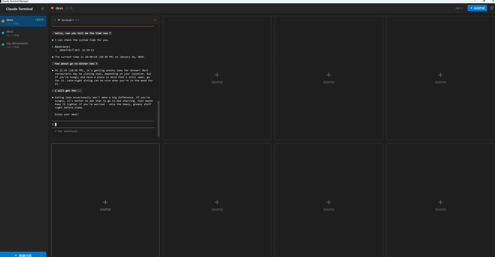

# Terminal Deck

A cross-platform multi-terminal manager designed for AI coding agents. Run and manage multiple Claude Code (or other AI agent) instances in a single, organized window.


## Screenshot



## Features

- **Multi-Terminal Grid** - Run multiple terminal instances side by side in customizable grid layouts (2x2, 2x3, 3x3, up to 4x4)
- **Group Management** - Organize terminals into groups by project or task, switch between groups instantly
- **Drag & Drop** - Move terminals between groups with drag and drop (preserves terminal session)
- **Custom Labels** - Double-click to rename any terminal for easy identification
- **Real-time Status** - Visual indicators show terminal status (running, idle, exited, error)
- **Keyboard Shortcuts** - Full keyboard navigation support
- **Cross-Platform** - Native support for Windows, macOS, and Linux
- **Persistent Config** - Automatically saves and restores your groups and settings
- **Multi-Language Support** - Interface available in Chinese and English (i18n)

## Installation

### Download Pre-built Binaries

Download the latest release for your platform from the [Releases](https://github.com/weihuan830/Terminal-Deck/releases) page:

- **Windows**: `Terminal-Deck-Setup-x.x.x.exe`
- **macOS**: `Terminal-Deck-x.x.x.dmg`
- **Linux**: `Terminal-Deck-x.x.x.AppImage` or `.deb`

### Build from Source

```bash
# Clone the repository
git clone https://github.com/weihuan830/Terminal-Deck.git
cd Terminal-Deck

# Install dependencies
npm install

# Run in development mode
npm run dev

# Build for production
npm run build
```

## Usage

### Getting Started

1. Launch Terminal Deck
2. Click **+ New Group** to create a terminal group (or press `Ctrl+N`)
3. Click **+ Add Terminal** to add terminals to the group (or press `Ctrl+T`)
4. Select a grid layout from the toolbar to arrange your terminals

### Working with Claude Code

Terminal Deck is optimized for running multiple Claude Code instances:

1. Create a group for your project
2. Add multiple terminals
3. In each terminal, navigate to your project and run `claude`
4. Monitor all your AI agents working simultaneously

### Keyboard Shortcuts

| Shortcut | Action |
|----------|--------|
| `Ctrl/Cmd + N` | New Group |
| `Ctrl/Cmd + T` | New Terminal |
| `Ctrl/Cmd + W` | Close Terminal |
| `Ctrl/Cmd + Tab` | Next Group |
| `Ctrl/Cmd + Shift + Tab` | Previous Group |
| `Alt/Option + Arrow Keys` | Navigate Terminals |

### Grid Layouts

Choose from multiple grid layouts to organize your terminals:

- 2x2 (4 terminals)
- 2x3 (6 terminals)
- 2x4 (8 terminals)
- 3x3 (9 terminals)
- 3x4 (12 terminals)
- 4x4 (16 terminals)

## Tech Stack

- **Electron** - Cross-platform desktop framework
- **React** - UI library
- **TypeScript** - Type-safe development
- **Zustand** - State management
- **xterm.js** - Terminal emulator
- **node-pty** - PTY process management
- **Tailwind CSS** - Styling
- **Vite** - Build tool
- **i18next** - Internationalization framework

## Project Structure

```
terminal-deck/
├── electron/           # Electron main process
│   ├── main.ts         # App entry point
│   ├── preload.ts      # Preload script (IPC bridge)
│   ├── terminal-manager.ts  # PTY process management
│   └── config-manager.ts    # Configuration persistence
├── src/                # React renderer process
│   ├── components/     # UI components
│   ├── hooks/          # Custom React hooks
│   ├── i18n/           # Internationalization (zh-CN, en)
│   ├── stores/         # Zustand state stores
│   ├── types/          # TypeScript types
│   └── utils/          # Utility functions
├── assets/             # App icons
└── public/             # Static assets
```

## Development

```bash
# Install dependencies
npm install

# Start development server with hot reload
npm run dev

# Lint code
npm run lint

# Format code
npm run format

# Build for production
npm run build
```

## Contributing

Contributions are welcome! Please read our [Contributing Guide](CONTRIBUTING.md) for details.

1. Fork the repository
2. Create your feature branch (`git checkout -b feature/amazing-feature`)
3. Commit your changes (`git commit -m 'Add some amazing feature'`)
4. Push to the branch (`git push origin feature/amazing-feature`)
5. Open a Pull Request

## License

This project is licensed under the MIT License - see the [LICENSE](LICENSE) file for details.

## Acknowledgments

- [xterm.js](https://xtermjs.org/) - Terminal emulator component
- [node-pty](https://github.com/microsoft/node-pty) - PTY bindings for Node.js
- [Electron](https://www.electronjs.org/) - Desktop app framework
- [Claude Code](https://claude.ai/) - AI coding assistant by Anthropic

---

Made with Claude Code
